<!-- ════════════════ Brand: #121212 · #FF5757 · #FFFFFF · Poppins ════════════════ -->

<p align="center">
  
</p>

<p align="center">
  
</p>

<p align="center">
  <a href="https://linkedin.com/in/nafeax" target="_blank"></a>
  <a href="https://github.com/NafeaC?tab=followers"></a>
</p>

---

## $\color{#FF5757}{\textsf{01}}$ &nbsp;About Me

I'm a **Backend Developer** and a **Computer Science graduate** from the **Faculty of Computers and Information, Mansoura University**.
I build the part of the product nobody sees but everybody relies on — fast APIs, clean data models, and systems that stay reliable as they grow.

- ⚙️ &nbsp;Building **RESTful APIs** and server-side applications with a focus on performance and maintainability
- 🗄️ &nbsp;Designing **relational & NoSQL databases** that scale with the business
- 🔐 &nbsp;Security-minded: **authentication, authorization & clean architecture**
- 🤖 &nbsp;Using **AI tools** every day to ship faster and smarter
- 🎨 &nbsp;Fluent in **design tools** — I see the full product, not just the server
- 🌱 &nbsp;Always learning, always sharpening the craft

```python
class AhmedNafea(BackendDeveloper):

    def __init__(self):
        self.role      = "Backend Developer"
        self.education = "B.Sc. Computer Science — Mansoura University"
        self.focus     = ["REST APIs", "Databases", "System Design"]
        self.stack     = ["Python", "PHP", "Node.js", "SQL"]
        self.mindset   = "Clean code. Scalable systems. Real impact."

    def work(self):
        while True:  # the loop never stops
            self.learn(); self.build(); self.ship()
```

---

## $\color{#FF5757}{\textsf{02}}$ &nbsp;What I Bring

| | Area | What I Do |
|:--:|:--|:--|
| $\color{#FF5757}{\textsf{01}}$ | **API Development** | RESTful APIs with versioning, validation and clear documentation |
| $\color{#FF5757}{\textsf{02}}$ | **Auth & Security** | JWT, OAuth2 and role-based access — secure by default |
| $\color{#FF5757}{\textsf{03}}$ | **Database Design** | Solid schemas, indexing, query optimization and migrations |
| $\color{#FF5757}{\textsf{04}}$ | **Performance** | Redis caching, queues and background jobs that keep things fast |
| $\color{#FF5757}{\textsf{05}}$ | **Architecture** | Clean architecture, SOLID principles and proven design patterns |
| $\color{#FF5757}{\textsf{06}}$ | **Deployment** | Docker, Linux, Nginx and CI/CD pipelines with GitHub Actions |

---

## $\color{#FF5757}{\textsf{03}}$ &nbsp;Tech Stack

<table width="100%">
  <tr>
    <td width="170"><b>💻 Languages</b></td>
    <td></td>
  </tr>
  <tr>
    <td><b>⚙️ Backend</b></td>
    <td></td>
  </tr>
  <tr>
    <td><b>🗄️ Databases</b></td>
    <td></td>
  </tr>
  <tr>
    <td><b>🚀 DevOps & Tools</b></td>
    <td></td>
  </tr>
</table>

---

## $\color{#FF5757}{\textsf{04}}$ &nbsp;AI Toolkit

<p align="left">
  
  
  
  
  
  
  
  
  
  
  
</p>

---

## $\color{#FF5757}{\textsf{05}}$ &nbsp;Design & Graphics

<p align="left">
  
</p>

---

## $\color{#FF5757}{\textsf{06}}$ &nbsp;GitHub Analytics

<!-- Cards are generated by .github/workflows/profile.yml → scripts/generate_cards.py -->
<p align="center">
  
  
</p>

<p align="center">
  
</p>

<p align="center">
  
</p>

<!-- Snake animation — generated by .github/workflows/profile.yml in this repo -->
<p align="center">
  <picture>
    <source media="(prefers-color-scheme: dark)" srcset="https://raw.githubusercontent.com/NafeaC/NafeaC/output/github-snake-dark.svg" />
    <source media="(prefers-color-scheme: light)" srcset="https://raw.githubusercontent.com/NafeaC/NafeaC/output/github-snake.svg" />
    
  </picture>
</p>

<br />

<p align="center">
  <a href="https://linkedin.com/in/nafeax" target="_blank"></a>
</p>
